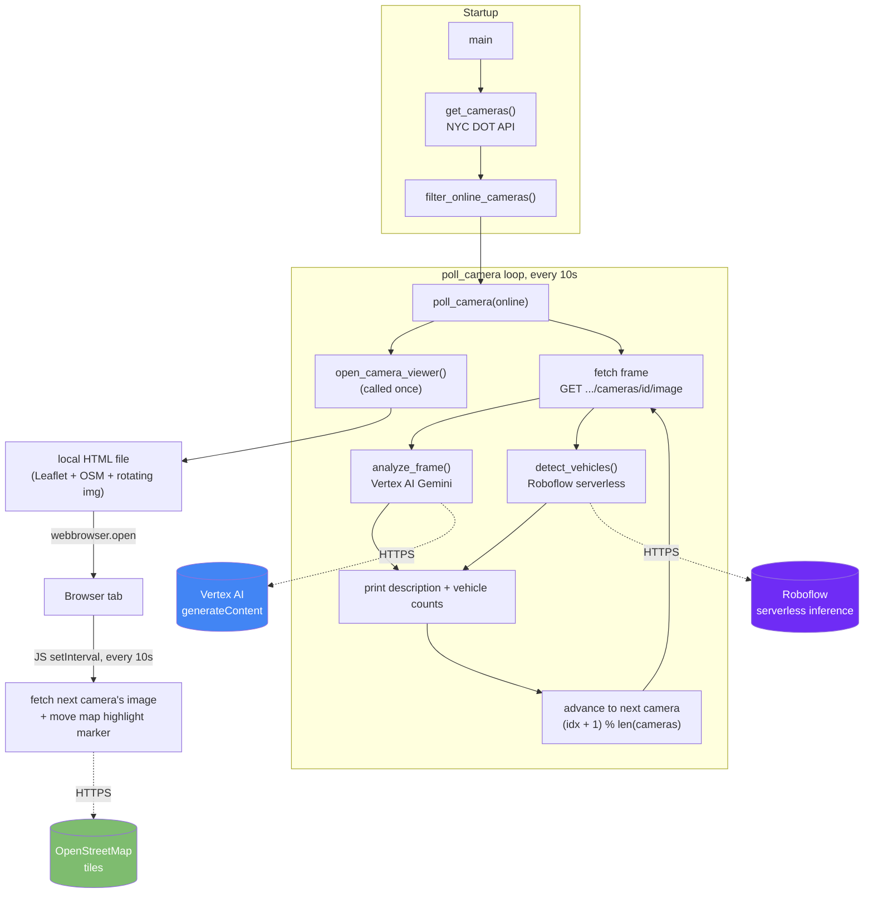

# Architecture Overview

## What this is

A single-process Python script that continuously rotates through NYC DOT's
public traffic cameras, runs two different AI analyses on each frame, and
displays a live-updating map + image viewer in the browser.

There is no server, no database, and no deployment target yet — `main.py`
is a self-contained script you run with `uv run main.py`. (See the note on
Cloud Run in [RUNBOOK.md](RUNBOOK.md#google-cloud-run) — the GCP project
this uses happens to be named for a Cloud Run hackathon, but the app itself
doesn't run on Cloud Run today.)

## Technologies

| Concern | Technology | Why |
|---|---|---|
| Language / runtime | Python 3.12+ | `requires-python = ">=3.12"` in `pyproject.toml` |
| Dependency management | [`uv`](https://docs.astral.sh/uv/) | Fast resolver, lockfile (`uv.lock`) committed for reproducible installs |
| Camera data source | NYC DOT Camera API (`webcams.nyctmc.org`) | Public, unauthenticated, no key needed |
| Scene description | Google Vertex AI — Gemini 2.5 Flash | Multimodal (image → text) description of traffic conditions |
| Object detection | Roboflow hosted inference (serverless) | Vehicle detection/counting on the same frame |
| Image decoding | OpenCV (`cv2`) + NumPy | Roboflow's SDK needs a decoded array, not raw JPEG bytes |
| Credentials | Google ADC (`gcloud auth application-default login`) + `.env` (Roboflow key) | See [RUNBOOK.md](RUNBOOK.md#credentials) |
| Browser viewer | Static local HTML file, opened via stdlib `webbrowser` | No web server — just a `file://` page |
| Map | [Leaflet.js](https://leafletjs.com/) + OpenStreetMap tiles, loaded from CDN inside that HTML file | Free, no API key; NYC DOT's own map page can't be iframed (`X-Frame-Options: DENY`) |

## Key APIs called

1. **`GET https://webcams.nyctmc.org/api/cameras`**
   Returns all cameras (id, name, borough, lat/lon, online status, per-camera image URL). Called once at startup.

2. **`GET https://webcams.nyctmc.org/api/cameras/{id}/image`**
   Returns the current JPEG frame for one camera. Called every rotation tick — once from Python (for analysis) and independently, on a separate timer, from the browser tab's JS (for display).

3. **Vertex AI `generateContent`** (via `vertexai.generative_models.GenerativeModel`)
   `projects/cloudrun-hack26nyc-4392/locations/us-central1/publishers/google/models/gemini-2.5-flash:generateContent`
   Sends the JPEG bytes + a text prompt, gets back a one-sentence traffic description.

4. **Roboflow serverless inference** (via `inference_sdk.InferenceHTTPClient`)
   `POST https://serverless.roboflow.com/vehicle-detection-3mmwj/1`
   Sends a decoded frame (numpy array), gets back bounding-box predictions with class labels, which are summarized into a count per vehicle class.

5. **OpenStreetMap tile server** — `https://{s}.tile.openstreetmap.org/{z}/{x}/{y}.png`
   Called directly by the browser (Leaflet), not by Python.

## Module map

`main.py` has no internal module boundaries yet (it's one file), but it
breaks cleanly into these responsibilities:

- `get_cameras()` / `filter_online_cameras()` — NYC DOT API client
- `analyze_frame()` — Vertex AI client
- `detect_vehicles()` — Roboflow client
- `open_camera_viewer()` — generates and opens the browser HTML/JS viewer
- `poll_camera()` — the orchestration loop tying the above together
- `main()` — entry point: fetch cameras, kick off the loop

## Important design note: two independent rotation loops

The Python terminal loop and the browser's JS `setInterval` both rotate
through the **same ordered camera list** (`online`, embedded into the HTML
as JSON at page-generation time) using the **same interval** (10s), so they
track each other closely. But they are two separate processes with no
communication channel between them — Python isn't driving the browser, and
the browser isn't calling back into Python. They start a few hundred
milliseconds apart (whenever `webbrowser.open()` returns vs. when the next
`time.sleep()` fires) and will drift slightly further apart the longer the
process runs, since neither side corrects for the other's timing. For a
demo this is close enough to look synchronized; it is not exact
synchronization.

If real synchronization ever matters, the fix is to replace the static
HTML file with a small local web server (e.g. Flask + Server-Sent Events)
that pushes the current camera index to the browser instead of each side
guessing independently.
