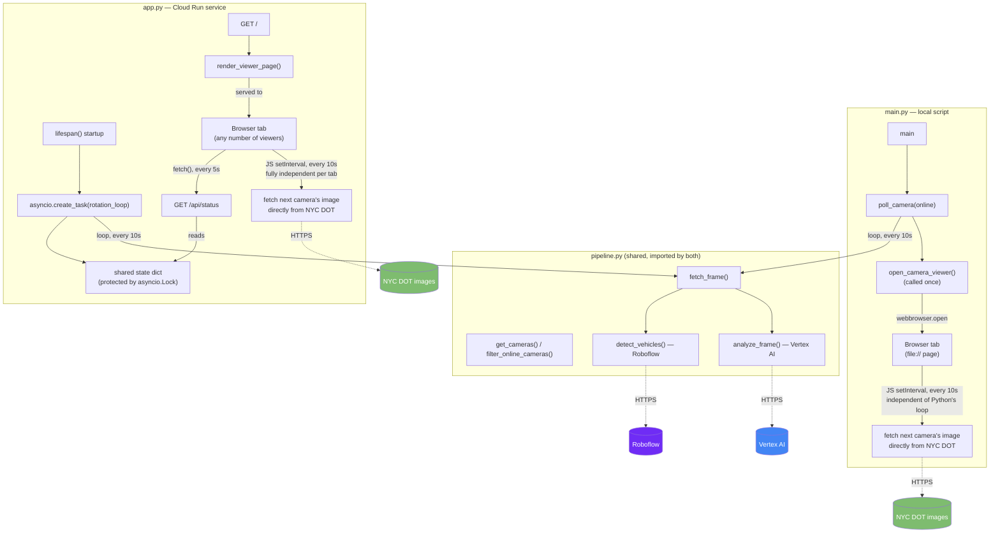

# Architecture Overview

## What this is

A pipeline that continuously rotates through NYC DOT's public traffic
cameras, runs two different AI analyses on each frame, and displays a
live-updating map + image viewer in the browser. It has **two entry
points sharing one core module**:

- **`main.py`** — a self-contained local script (`uv run main.py`) that
  opens a browser tab itself via `webbrowser.open()`. No server, no
  database. This was the original implementation.
- **`app.py`** — a FastAPI web service exposing the same viewer over
  HTTP, meant to be deployed (this has been verified working) on **Google
  Cloud Run**. See
  [design/cloud-run-deployment.md](design/cloud-run-deployment.md) for
  the design and [RUNBOOK.md](RUNBOOK.md#google-cloud-run) for the actual
  deploy steps and the two IAM issues hit along the way.

Both import their NYC DOT / Vertex AI / Roboflow logic from **`pipeline.py`**
rather than duplicating it — see [Module map](#module-map) below.

## Technologies

| Concern | Technology | Why |
|---|---|---|
| Language / runtime | Python 3.12+ | `requires-python = ">=3.12"` in `pyproject.toml` |
| Dependency management | [`uv`](https://docs.astral.sh/uv/) | Fast resolver, lockfile (`uv.lock`) committed for reproducible installs |
| Camera data source | NYC DOT Camera API (`webcams.nyctmc.org`) | Public, unauthenticated, no key needed |
| Scene description | Google Vertex AI — Gemini 2.5 Flash | Multimodal (image → text) description of traffic conditions |
| Object detection | Roboflow hosted inference (serverless) | Vehicle detection/counting on the same frame |
| Image decoding | OpenCV (`cv2`) + NumPy | Roboflow's SDK needs a decoded array, not raw JPEG bytes |
| Credentials | Google ADC (`gcloud auth application-default login`) + `.env` (Roboflow key) | See [RUNBOOK.md](RUNBOOK.md#credentials) |
| Browser viewer (`main.py`) | Static local HTML file, opened via stdlib `webbrowser` | No web server — just a `file://` page |
| Browser viewer (`app.py`) | Same HTML/JS, served over HTTP | [FastAPI](https://fastapi.tiangolo.com/) + [Uvicorn](https://www.uvicorn.org/) ASGI server |
| Map | [Leaflet.js](https://leafletjs.com/) + OpenStreetMap tiles, loaded from CDN inside the served/generated page | Free, no API key; NYC DOT's own map page can't be iframed (`X-Frame-Options: DENY`) |
| Containerization | `Dockerfile`, Python 3.12-slim base, [`uv`](https://docs.astral.sh/uv/) for install | Only needed for `app.py` — `main.py` never runs in a container |
| Deployment | Google Cloud Run | Verified working via `gcloud run deploy --source .`; see [RUNBOOK.md](RUNBOOK.md#google-cloud-run) |

## Key APIs called

1. **`GET https://webcams.nyctmc.org/api/cameras`**
   Returns all cameras (id, name, borough, lat/lon, online status, per-camera image URL). Called once at startup.

2. **`GET https://webcams.nyctmc.org/api/cameras/{id}/image`**
   Returns the current JPEG frame for one camera. Called every rotation tick — once from Python (for analysis) and independently, on a separate timer, from the browser tab's JS (for display).

3. **Vertex AI `generateContent`** (via the `google-genai` SDK's `client.models.generate_content()`)
   `projects/cloudrun-hack26nyc-4392/locations/us-central1/publishers/google/models/gemini-2.5-flash:generateContent`
   Sends the JPEG bytes + a text prompt, gets back a one-sentence traffic description.

4. **Roboflow serverless inference** (via `inference_sdk.InferenceHTTPClient`)
   `POST https://serverless.roboflow.com/vehicle-detection-3mmwj/1`
   Sends a decoded frame (numpy array), gets back bounding-box predictions with class labels, which are summarized into a count per vehicle class.

5. **OpenStreetMap tile server** — `https://{s}.tile.openstreetmap.org/{z}/{x}/{y}.png`
   Called directly by the browser (Leaflet), not by Python.

### APIs this project exposes (app.py only)

Deploying `app.py` means this project also *serves* two endpoints of its
own — see [API_EXAMPLES.md](API_EXAMPLES.md#5-our-own-api--apppy-cloud-run-service)
for real captured examples:

6. **`GET /`** — the viewer page (HTML/CSS/JS), same content `main.py`
   would write to a temp file, served over HTTP instead.
7. **`GET /api/status`** — JSON with whatever camera the server's
   background rotation loop most recently analyzed. Polled by the page's
   own JS every 5 seconds.

## Module map

Shared logic lives in **`pipeline.py`**: `get_cameras()`,
`filter_online_cameras()`, `fetch_frame()`, `build_vertex_client()`,
`build_roboflow_client()`, `analyze_frame()`, `detect_vehicles()`. Neither
entry point defines these itself.

**`main.py`** (local):
- `open_camera_viewer()` — generates and opens the browser HTML/JS viewer as a local file
- `poll_camera()` — the orchestration loop, one camera per `interval` seconds, printed to stdout
- `main()` — entry point: fetch cameras, kick off the loop

**`app.py`** (Cloud Run service):
- `render_viewer_page()` — same HTML/JS as `open_camera_viewer()`, returned as a string instead of written to a file, plus a small analysis panel + polling script
- `rotation_loop()` — an `asyncio` background task doing the same rotation as `poll_camera()`, but writing to a shared in-memory `state` dict instead of printing
- `lifespan()` — FastAPI startup hook: fetch cameras once, launch `rotation_loop()` as a background task
- `GET /` / `GET /api/status` — the two endpoints described above

## Important design note: two independent rotation loops

The Python terminal loop and the browser's JS `setInterval` both rotate
through the **same ordered camera list** (`online`, embedded into the HTML
as JSON at page-generation time) using the **same interval** (10s), so they
track each other closely. But they are two separate processes with no
communication channel between them — Python isn't driving the browser, and
the browser isn't calling back into Python. They start a few hundred
milliseconds apart (whenever `webbrowser.open()` returns vs. when the next
`time.sleep()` fires) and will drift slightly further apart the longer the
process runs, since neither side corrects for the other's timing. For a
demo this is close enough to look synchronized; it is not exact
synchronization.

If real synchronization ever matters, the fix is to replace the static
HTML file with a small local web server (e.g. Flask + Server-Sent Events)
that pushes the current camera index to the browser instead of each side
guessing independently.

**`app.py` has a related but worse version of this same problem.** There,
the server's `rotation_loop()` starts once at deploy/cold-start time, but
*every browser tab* that later loads the page starts its own independent
image-rotation timer from index 0 at whatever moment it happened to load
— there's no shared starting point at all, for any tab, ever. The analysis
panel can end up describing a materially different camera than the one
currently pictured, not just a delayed version of it. This is documented
in detail, with concrete future fix options, in
[design/cloud-run-deployment.md](design/cloud-run-deployment.md#known-limitation-found-during-implementation-image-and-analysis-can-point-at-different-cameras)
— it's unresolved, called out explicitly in the deployed page's UI rather
than fixed.
