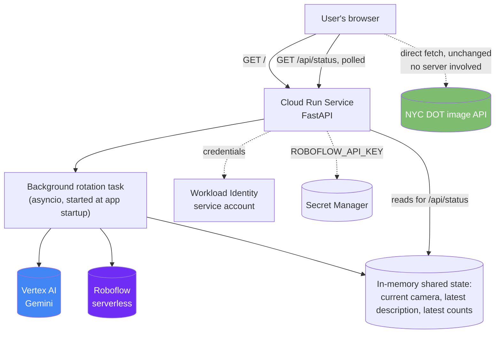

# Design: Deploying to Google Cloud Run

**Status:** The Recommended option below has been **implemented (`app.py`,
`pipeline.py`, `Dockerfile`) and verified deployed on Cloud Run** — see
[RUNBOOK.md](../RUNBOOK.md#google-cloud-run) for the real deploy steps and
[CODE_WALKTHROUGH.md](../CODE_WALKTHROUGH.md#apppy--cloud-run-service) for
how the code works. The [known limitation](#known-limitation-found-during-implementation-image-and-analysis-can-point-at-different-cameras)
found during implementation remains unresolved. The Alternative
(Jobs + Scheduler) below is still just a proposal, not built. See
[local-deployment.md](local-deployment.md) for the separate, independent
"remove all cloud dependencies" design — the two are not meant to be
combined.

## Problem

`main.py` runs as a local script: an infinite polling loop, a browser tab
opened via `webbrowser.open()` on the machine running it, and progress
printed to a terminal someone is watching. None of that is how Cloud Run
works — there's no display to open a browser on, no terminal to watch, and
(for the recommended shape below) no "infinite loop" primitive without
extra care, since Cloud Run's whole model is built around handling
requests and scaling instances up and down, including to zero.

This document designs two ways to actually get this app running on Cloud
Run, and recommends one.

## Goals

- Make the live, rotating camera+map+analysis demo reachable at a URL,
  shareable without anyone needing to run Python locally.
- Keep the credential and cost realities honest — no hand-waving past the
  fact that "serverless" doesn't mean "free" or "infinitely scalable" for
  a workload shaped like this one.
- Design for Cloud Run specifically, not a generic "containerize it" doc.

## Non-goals

- Removing the Vertex AI / Roboflow dependency — that's
  [local-deployment.md](local-deployment.md)'s job, not this one's. This
  design assumes those stay.
- Solving the [963-camera throughput problem](../PRODUCTION_READINESS.md#throughput--the-963-camera-problem)
  in the recommended option — it's called out below as unsolved by that
  option, and solved essentially for free by the alternative.
- Multi-region deployment, custom domains, auth — out of scope for a first
  design pass.

## Two shapes, and which one fits "this app"

Cloud Run has two fundamentally different products: **Services** (long-lived,
handle HTTP requests, can scale to zero between requests) and **Jobs** (run
a fixed task to completion, then exit — think "cron job," not "web server").
This app, as built, is a live interactive demo — that only maps onto
**Services**. Jobs would produce a genuinely different product (a batch
pipeline with no live viewer), which is why it's the alternative here, not
the recommendation, even though it's arguably a *better architectural fit*
for Cloud Run's serverless model. That tension is real and discussed
honestly below rather than picked around.

## Recommended: Cloud Run Service (always-on web app)

### Architecture



Key design decision: **the camera image and map stay entirely client-side,
unchanged.** The browser already fetches camera images directly from
`webcams.nyctmc.org` and renders the Leaflet map itself — none of that
needs to go through the Cloud Run service at all. The only thing the
server needs to provide is the *analysis* (Gemini description, Roboflow
counts), which is the only part that requires server-side credentials and
compute. This keeps the change scoped: most of `open_camera_viewer()`'s
generated JS is reusable close to as-is.

### Code changes

`main.py`'s `poll_camera()` loop logic (rotate through cameras, call
`analyze_frame`/`detect_vehicles`) stays conceptually the same, but moves
from a blocking `while True` with `print()` into a background `asyncio`
task that updates shared state instead of printing:

```python
# illustrative — not implemented
import asyncio
from fastapi import FastAPI
from fastapi.responses import HTMLResponse, JSONResponse

app = FastAPI()
state = {"camera": None, "description": None, "vehicles": None, "updated_at": None}
state_lock = asyncio.Lock()

async def rotation_loop(all_cams, interval=10):
    idx = 0
    while True:
        cam = all_cams[idx]
        try:
            frame = await asyncio.to_thread(fetch_frame, cam["imageUrl"])
            description = await asyncio.to_thread(analyze_frame, model, frame)
            vehicles = await asyncio.to_thread(detect_vehicles, roboflow_client, frame)
            async with state_lock:
                state.update(camera=cam, description=description, vehicles=vehicles, updated_at=time.time())
        except Exception as e:
            logging.exception("cycle failed for %s", cam.get("name"))
        idx = (idx + 1) % len(all_cams)
        await asyncio.sleep(interval)

@app.on_event("startup")
async def startup():
    cams = get_cameras()
    online = filter_online_cameras(cams)
    asyncio.create_task(rotation_loop(online))

@app.get("/", response_class=HTMLResponse)
async def index():
    return render_viewer_page()   # same HTML/Leaflet JS as today, served instead of written to a temp file

@app.get("/api/status")
async def status():
    async with state_lock:
        return JSONResponse(state)
```

The `asyncio.to_thread(...)` wrapping matters: `requests`, the Vertex AI
SDK, and `inference_sdk` are all **synchronous, blocking** calls. Calling
them directly inside an `async def` would freeze the entire event loop —
including the `/api/status` endpoint every other viewer is polling —
for the full duration of each Gemini/Roboflow call. Running them in a
thread pool via `asyncio.to_thread` is what keeps the server responsive
while a slow API call is in flight.

The page's client-side JS gains one addition: a `setInterval` that polls
`/api/status` and updates the description/vehicle-count text on screen —
everything else (image rotation, map markers) is unchanged from today's
generated page.

### Containerization

```dockerfile
# illustrative — not implemented
FROM python:3.12-slim
COPY --from=ghcr.io/astral-sh/uv:latest /uv /uvx /bin/
WORKDIR /app
COPY pyproject.toml uv.lock ./
RUN uv sync --frozen --no-dev
COPY . .
CMD exec uv run uvicorn app:app --host 0.0.0.0 --port ${PORT:-8080}
```

Cloud Run injects a `PORT` environment variable (default `8080`) and
expects the container to listen on it — the `${PORT:-8080}` shell
expansion (note: shell form `CMD`, not exec-form array syntax, so the
variable actually expands) is what makes that work.

### Deployment

```bash
# illustrative — not implemented
gcloud run deploy nyc-dot-cams \
  --source . \
  --region us-central1 \
  --service-account nyc-dot-cams-run@PROJECT_ID.iam.gserviceaccount.com \
  --set-secrets ROBOFLOW_API_KEY=roboflow-api-key:latest \
  --min-instances=1 \
  --max-instances=1 \
  --memory 512Mi \
  --allow-unauthenticated
```

Two flags here are load-bearing, not defaults to accept blindly:

- **`--min-instances=1`** — without it, Cloud Run scales an idle service
  to zero, which would kill the background rotation loop between viewer
  visits. This is the fundamental tension flagged above: **this defeats
  Cloud Run's headline cost benefit.** You're paying for one always-on
  instance continuously, same as a small VM would cost, not "pay only
  when someone's watching." Budget for that explicitly rather than
  assuming Cloud Run pricing means near-zero cost here.
- **`--max-instances=1`** — just as important in the other direction. If
  Cloud Run ever scales to 2+ instances (concurrent viewer traffic could
  trigger this without the cap), you'd get two independent rotation
  loops running simultaneously — double the Vertex AI/Roboflow spend, and
  different viewers could see different "current camera" state depending
  which instance handled their request, since state is in-memory and not
  shared across instances. Capping at 1 keeps a single rotation loop
  authoritative, at the cost of a hard ceiling: **this design cannot
  horizontally scale** without moving shared state out of process memory
  and into something like Firestore or Redis — a real follow-up if this
  ever needs to serve meaningfully concurrent traffic.

### Credentials

- A dedicated service account for the Cloud Run service, granted
  `roles/aiplatform.user` — no JSON key file, no ADC file; Cloud Run
  services authenticate to Vertex AI using their attached service account
  automatically (Workload Identity).
- **Known risk, not hypothetical:** granting that IAM role via
  `gcloud projects add-iam-policy-binding` failed earlier in this
  project's history with `Policy update access denied`, on the same
  hackathon-sandboxed GCP project this app currently uses (see
  [RUNBOOK.md](../RUNBOOK.md#credentials)). If deploying under that same
  project, expect to hit this again — it would need a real (non-sandbox)
  GCP project, or the sandbox's deny-policy lifted by whoever administers
  it, before this deployment could get IAM permissions sorted out at all.
- `ROBOFLOW_API_KEY` moves from `.env` to Secret Manager, mounted as an
  env var via `--set-secrets` at deploy time.

### Observability

Cloud Run automatically captures container stdout/stderr into Cloud
Logging — switching the code from `print()` to the stdlib `logging`
module (already recommended in
[PRODUCTION_READINESS.md](../PRODUCTION_READINESS.md#observability))
means real, queryable, timestamped logs "for free" the moment this
deploys, with no extra logging infrastructure to stand up.

### Cost shape

Two additive costs, not one:
1. **Cloud Run compute** for one always-on small instance (`min-instances=1`,
   512Mi) — modest, on the order of a few dollars a month, not the
   dominant cost.
2. **Vertex AI + Roboflow API calls**, unchanged from today's per-call
   economics — still the ~$15/day figure from
   [PRODUCTION_READINESS.md](../PRODUCTION_READINESS.md#cost-the-thinking-token-problem)
   if the rotation loop runs continuously, which it now does 24/7 by
   design (an always-deployed service, not a script you start and stop).
   **Deploying this to Cloud Run turns an occasional-demo cost into a
   continuous one** — worth deciding on a budget cap or a
   stop/start schedule (e.g., scale `min-instances` to 0 outside demo
   hours via a Cloud Scheduler job) rather than letting it run unbounded.

### Known limitation (found during implementation): image and analysis can point at different cameras

**Status: unresolved, tracked here as a future enhancement, not fixed in
the initial implementation.**

#### Root cause

Two independent, uncoordinated timers decide "what camera" at any given
moment:

- **The browser's image rotation** is a `setInterval` in the page's own
  JS, started the instant that browser tab loads `render_viewer_page()`'s
  HTML. It walks the embedded `cameras` array using an index that lives
  only in that tab's memory.
- **The server's analysis rotation** is `rotation_loop()`, a single
  `asyncio` task started once at server startup (`lifespan`), walking the
  same `all_cameras` list independently, at the same 10s interval, but on
  its own clock and its own index.

Both loops iterate the *same ordered list* at the *same interval*, which
makes it easy to assume they'd track each other the way the original
local `main.py` version's two loops roughly do (see
[ARCHITECTURE.md](../ARCHITECTURE.md#important-design-note-two-independent-rotation-loops)).
They don't, for a reason specific to the Service architecture: in
`main.py`, there is exactly one Python process and one browser tab,
started within milliseconds of each other, so "roughly in sync, drifting
slowly" is a fair description. In `app.py`, the server loop starts once,
at deploy/cold-start time — but every browser tab that opens the page
afterward starts its *own* image rotation from index 0 at whatever moment
*it* happened to load. Two tabs opened five minutes apart show completely
different images at any instant, and neither is likely to line up with
wherever the single server loop currently is. This isn't clock drift
around a shared starting point; there was never a shared starting point.

#### Concrete impact

Open the deployed page, watch the "Server analysis" panel and the
pictured camera above it for a minute: the panel will report on a camera
name that frequently doesn't match the `<h2>` title over the image. The
UI now says this explicitly (`"may be a different camera than pictured
above"`) rather than implying simple lag, but that's a disclosure, not a
fix — the actual product experience is "the description you're reading is
often not about the picture you're looking at."

#### Why "just poll faster" doesn't fix it

Reducing the client's `pollStatus()` interval (currently 5s) only reduces
how *stale* the displayed analysis is relative to the server's own
rotation — it does nothing to align *which camera* the server is
currently on with *which camera* any given tab is currently displaying,
since those two indices are computed completely independently. Polling
frequency and synchronization are different problems.

#### Future fix options

1. **Make the server authoritative for image display too (simplest).**
   Drop the client's independent `setInterval`/index entirely. Instead,
   have `pollStatus()` set `camImg.src` to `state.camera`'s `imageUrl`
   directly — the image and the analysis both come from whatever the
   server's single loop currently says is "current." Every viewer sees
   the *same* camera at the *same* time, which for a shared demo is
   arguably the more intuitive behavior anyway ("everyone's watching the
   same feed" rather than "everyone's on their own independent tour").
   Tradeoff: image updates now happen only as often as the server
   rotates (10s) and only one camera is ever visible fleet-wide at a
   time — the current "each tab can browse independently" feel goes away.
   Cheapest option to build: no new endpoints, just deleting client-side
   rotation code and repointing `camImg.src`.

2. **On-demand, per-camera analysis with short-TTL caching.** Let each
   client's independent image rotation stay exactly as it is today, and
   change `/api/status` to accept the currently-displayed camera's ID
   (e.g. `/api/status?camera_id=...`), analyzing *that* camera on request
   instead of whatever a background loop happens to be on. To avoid
   paying for a fresh Gemini/Roboflow call on every single poll from every
   viewer, cache each camera's result for a few seconds (in-memory dict
   keyed by camera ID, same `state_lock` pattern, entries expired after
   e.g. 15s) so simultaneous viewers on the same camera share one
   analysis. Preserves today's "browse independently" feel exactly.
   Tradeoff: real implementation complexity (cache eviction, and a cache
   stampede if many viewers are on different cameras at once means many
   concurrent Gemini/Roboflow calls — could exceed the cost model this
   design assumed, since spend now scales with *distinct cameras being
   viewed*, not a fixed rotation rate).

3. **Push instead of poll (WebSocket or Server-Sent Events).** Same
   authoritative-server model as option 1, but instead of the client
   polling `/api/status` every 5s, the server pushes an update the moment
   `rotation_loop()` advances. Removes polling latency/staleness entirely
   and is the "correct" real-time architecture, at the cost of the most
   implementation work of the three (connection lifecycle management,
   reconnection handling, FastAPI's WebSocket/SSE support instead of a
   plain REST endpoint).

**Recommendation for whoever picks this up:** start with option 1. It's
the smallest change, it's honest about the single-shared-loop cost model
this whole design already commits to (see `--max-instances=1` above —
this design already accepted "one authoritative rotation loop," option 1
just extends that same decision to the image, rather than introducing a
second axis of independence that fights it), and it can evolve into
option 3 later (push instead of poll) without changing the "server is
authoritative" model. Option 2 is worth it only if "each viewer browses
independently" turns out to matter more than the cost predictability of a
single shared rotation rate.

## Alternative: Cloud Run Jobs + Cloud Scheduler

A structurally different product, sketched at lower detail since it's not
the recommendation: instead of a live server, `main.py` becomes a script
that runs once, processes a batch of cameras, writes results somewhere
durable, and exits — no infinite loop, no browser, no live viewer at all.

- **Cloud Scheduler** triggers a **Cloud Run Job** execution on a cron
  schedule (e.g., every 10 minutes).
- Each execution: fetch cameras, analyze some subset, write each result
  (description, vehicle counts, timestamp) to Firestore or BigQuery, exit.
- **Cloud Run Jobs natively support parallel task indexing**
  (`--tasks=N`, with each task reading `CLOUD_RUN_TASK_INDEX` to know
  which slice of cameras to handle) — this is a genuinely elegant, close
  to free fix for the
  [963-camera throughput problem](../PRODUCTION_READINESS.md#throughput--the-963-camera-problem)
  that the recommended option above does *not* solve; splitting cameras
  across N parallel tasks shrinks a ~3-hour full pass roughly
  proportionally to N, without any custom concurrency code.
- True scale-to-zero economics: you pay only for the minutes each
  scheduled execution actually runs, not for an always-on instance.
- **What's lost:** the live, watchable demo. There's no browser tab to
  open — viewing results means querying Firestore/BigQuery directly, or
  building a separate (out of scope here) small dashboard on top of that
  data. This is a real product change, not just an infrastructure change,
  which is exactly why it's the alternative and not the recommendation:
  it stops being "this app, deployed," and starts being a different app
  that happens to reuse this one's analysis functions.

## Open questions

- Is the always-on cost (compute + continuous API spend) actually
  acceptable, or does the recommended option need a scheduled
  start/stop (e.g., `min-instances=1` only during business hours) bolted
  on to be viable long-term?
- Does the IAM deny-policy on the current sandbox project block this
  entirely until a non-sandbox project is available? Worth confirming
  before investing implementation time.
- If concurrent viewers ever matter, is the max-instances=1 ceiling
  acceptable indefinitely, or should shared state move to Firestore/Redis
  sooner rather than later?
