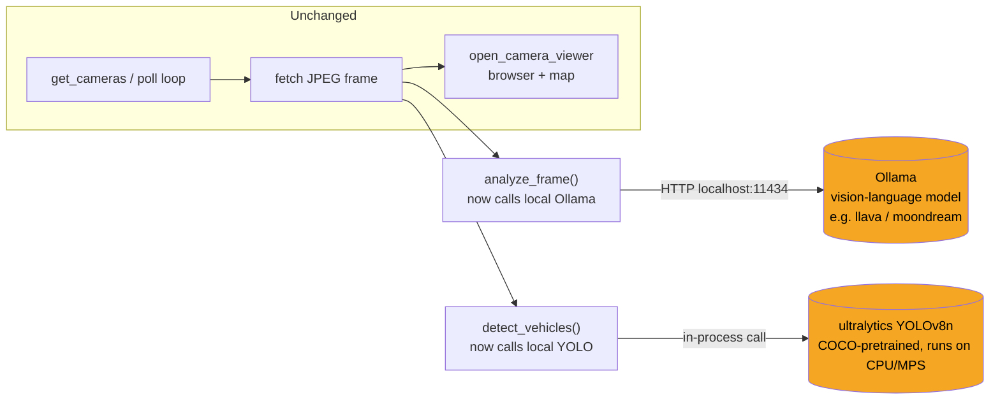

# Design: Fully Local Deployment

**Status:** Draft — not implemented. This is a proposal, not a plan someone
has committed to building.
**Author context:** written 2026-08-08, immediately after the current
prototype's Vertex AI and Roboflow access was known to be expiring within
24 hours.

## Problem

The current implementation ([ARCHITECTURE.md](../ARCHITECTURE.md)) depends
on two external, account-gated cloud services for its actual "intelligence":

1. **Vertex AI (Gemini 2.5 Flash)** — scene description, tied to a specific
   temporary GCP project (`cloudrun-hack26nyc-4392`) and Application
   Default Credentials scoped to one Google account.
2. **Roboflow serverless inference** — vehicle detection, tied to an API
   key with demo/free-tier access.

Both are gone the moment access lapses, and both cost money per call even
while they work (see [PRODUCTION_READINESS.md](../PRODUCTION_READINESS.md#cost-the-thinking-token-problem)
— roughly $15/day if left running continuously). Anyone who clones this
repo without their own GCP project and Roboflow account can't run the
analysis parts of it at all.

This document proposes an architecture that replaces both with models
running entirely on the user's own machine — no cloud account, no API key,
no per-call billing, no expiring demo credentials.

## Goals

- Run `analyze_frame()`-equivalent (scene description) and
  `detect_vehicles()`-equivalent (vehicle detection) entirely on-device.
- Zero required cloud accounts or API keys to run the analysis pipeline.
- Keep the rest of the architecture — camera rotation, the browser
  viewer, the map — unchanged. This is a swap of two functions' internals,
  not a rewrite.
- Work on a MacBook (this project's actual dev environment) without
  requiring a discrete GPU.

## Non-goals

- **Making the camera data source local.** NYC DOT traffic cameras are
  physically real, remote hardware — `get_cameras()` and the per-camera
  image fetch will always require internet access to reach
  `webcams.nyctmc.org`. "Fully local" here means *local inference*, not an
  offline app; there's no way to monitor live traffic without a live feed.
- **Matching Gemini's output quality exactly.** Local vision-language
  models in the size range that runs comfortably on a laptop are smaller
  and less capable than Gemini 2.5 Flash. This is an accepted tradeoff for
  removing the cloud dependency, not something this design tries to fully
  close.
- **Real-time performance at the current 963-camera scale.** The
  throughput problem described in
  [PRODUCTION_READINESS.md](../PRODUCTION_READINESS.md#throughput--the-963-camera-problem)
  is orthogonal to this design and not solved by it — going local likely
  makes per-frame latency *worse*, not better (see [Risks](#risks--open-questions)).

## Proposed architecture



Both replacements run **on the same machine as `main.py`** — no server,
no Docker required for the detection path (see [Alternatives](#alternatives-considered)
for why Docker is avoidable here, unlike the earlier "run Roboflow
locally" discussion this project had).

## Component design

### Scene description: Ollama

[Ollama](https://ollama.com) runs models locally and exposes an HTTP API
on `localhost:11434` — structurally similar to what `analyze_frame()`
already does (send an image + prompt, get text back), so the swap is
localized to one function.

**Model choice:** a small vision-language model, not a full-size one.
Candidates, smallest/fastest to largest/best:
- `moondream` (~1.8B params) — fastest, weakest reasoning; likely fine for
  "describe this traffic scene in one sentence."
- `llava` (7B/13B variants) — the most established local VLM, good
  quality/speed balance at 7B.
- `qwen2-vl` (7B) — newer, generally strong on this kind of grounded
  description task.

Recommendation: start with `llava:7b` as the default — well-documented,
predictable behavior — and treat `moondream` as the fallback if latency on
the target machine is too high. This should be validated empirically
(see [Migration plan](#migration-plan)), not assumed.

**Interface sketch** (illustrative, not final code):
```python
import requests

def analyze_frame(frame):
    response = requests.post("http://localhost:11434/api/generate", json={
        "model": "llava:7b",
        "prompt": "Describe the traffic and road conditions visible in this camera image in one concise sentence.",
        "images": [base64.b64encode(frame).decode()],
        "stream": False,
    })
    return response.json()["response"].strip()
```

No `vertexai.init()`, no `PROJECT_ID`/`LOCATION`, no ADC file — the
`model` parameter it takes today can go away entirely, since there's no
persistent client object to construct ahead of time (Ollama's API is
stateless per-request).

### Vehicle detection: local YOLO, not "Roboflow, but local"

This project already looked at Roboflow's own local option
(`inference server start`, a Docker container serving on
`localhost:9001`) when the hosted API's key restrictions first came up —
see the troubleshooting history in [RUNBOOK.md](../RUNBOOK.md#roboflow).
That's a valid option, but it still requires Docker and, to pull a model
at all, a Roboflow account. For a design that's meant to remove account
dependencies entirely, it only half-solves the problem.

Proposed instead: **[`ultralytics`](https://docs.ultralytics.com/) YOLOv8n**,
a pip-installable package with a COCO-pretrained model that downloads once
(~6MB) and then runs fully offline, no account of any kind. COCO's classes
already include `car`, `truck`, `bus`, and `motorcycle` — a superset of the
single generic `"vehicle"` class the current Roboflow model returns (see
[API_EXAMPLES.md](../API_EXAMPLES.md#4-roboflow--inferencehttpclientinfer)),
so `detect_vehicles()`'s counting logic barely changes — just group by
class name as before, optionally collapsing the four vehicle classes into
one count if parity with today's single `"vehicle"` label matters.

**Interface sketch:**
```python
from ultralytics import YOLO

VEHICLE_CLASSES = {"car", "truck", "bus", "motorcycle"}
model = YOLO("yolov8n.pt")  # downloaded once, cached locally after

def detect_vehicles(frame):
    image = cv2.imdecode(np.frombuffer(frame, dtype=np.uint8), cv2.IMREAD_COLOR)
    results = model(image, verbose=False)[0]
    counts = {}
    for box in results.boxes:
        cls_name = model.names[int(box.cls)]
        if cls_name in VEHICLE_CLASSES:
            counts[cls_name] = counts.get(cls_name, 0) + 1
    if not counts:
        return "no vehicles detected"
    return ", ".join(f"{count} {cls}" for cls, count in sorted(counts.items()))
```

Notably, this drops the `inference_sdk`/`roboflow` dependencies and the
`ROBOFLOW_API_KEY`/`.env` requirement entirely.

## Migration plan

1. **Spike, don't commit:** install Ollama + pull `llava:7b`, install
   `ultralytics`, and run both against a handful of frames saved from
   [API_EXAMPLES.md](../API_EXAMPLES.md) (the sample JPEG is small and
   already captured). Compare output quality and measure wall-clock
   latency per frame on the actual dev machine before deciding anything.
2. **Config flag, not a hard cutover:** add a `LOCAL_MODE` (or
   `ANALYSIS_BACKEND=cloud|local`) setting so `analyze_frame`/
   `detect_vehicles` can dispatch to either implementation. This keeps the
   cloud path available for anyone who *does* have Vertex AI/Roboflow
   access and wants the higher-quality output, while making local the
   no-account-required default.
3. **Swap the two functions** behind that flag, per the interface
   sketches above. `poll_camera`, `open_camera_viewer`, and everything
   else in [CODE_WALKTHROUGH.md](../CODE_WALKTHROUGH.md) stays as-is.
4. **Update dependencies:** `uv add ollama ultralytics` (or just `requests`
   for the Ollama HTTP calls — no dedicated Ollama Python package is
   required), and make `google-cloud-aiplatform`/`inference-sdk`/`roboflow`
   optional (only needed if `ANALYSIS_BACKEND=cloud`).
5. **Update the runbook** so a fresh clone can be running with zero cloud
   accounts, not just faster setup — genuinely zero.

## Risks / open questions

- **Latency is probably worse, not better.** A cloud TPU/GPU running
  Gemini or Roboflow's hosted models is very likely faster per-call than a
  7B vision model on a MacBook's CPU/MPS, especially for the first call
  after the model loads. This could make the existing 10s rotation
  interval too tight — needs the empirical spike in step 1 above before
  assuming otherwise.
- **Running two models locally at once** (a VLM for description, YOLO for
  detection) means sharing RAM/CPU on one machine, which could interact
  badly with everything else running (browser, IDE). Worth checking
  peak memory usage, not just per-model footprint.
- **Output quality gap is real and probably visible.** Gemini's one-sentence
  descriptions in [API_EXAMPLES.md](../API_EXAMPLES.md) are fluent and
  contextual ("wet, reflective road" implying recent rain); a small local
  VLM may produce flatter, more literal descriptions. Whether that's good
  enough depends entirely on what the output is used for.
- **Ollama model licensing** varies by model (Llava is Apache/Llama-family
  licensed depending on base model, Qwen2-VL has its own license) — worth
  a quick check before picking one, same as the open licensing question
  already flagged for the Roboflow public model in
  [PRODUCTION_READINESS.md](../PRODUCTION_READINESS.md#also-worth-knowing).

## Alternatives considered

- **Roboflow local inference server** (Docker, `localhost:9001`) instead
  of `ultralytics` — kept the existing Roboflow-trained model and its
  single `"vehicle"` class, at the cost of requiring Docker and (at least
  once) a Roboflow account to pull the model. Rejected as the primary
  recommendation because it only removes half the account dependency;
  documented here in case matching the exact current model output matters
  more than removing every external account.
- **A hosted-but-cheaper cloud model** (e.g., a smaller Gemini variant, or
  disabling "thinking" via `thinking_budget`) instead of going local —
  solves the cost problem from
  [PRODUCTION_READINESS.md](../PRODUCTION_READINESS.md#cost-the-thinking-token-problem)
  without solving the "needs an account that can expire" problem this
  document is specifically about. Complementary, not a substitute — worth
  doing regardless of whether local deployment happens.
